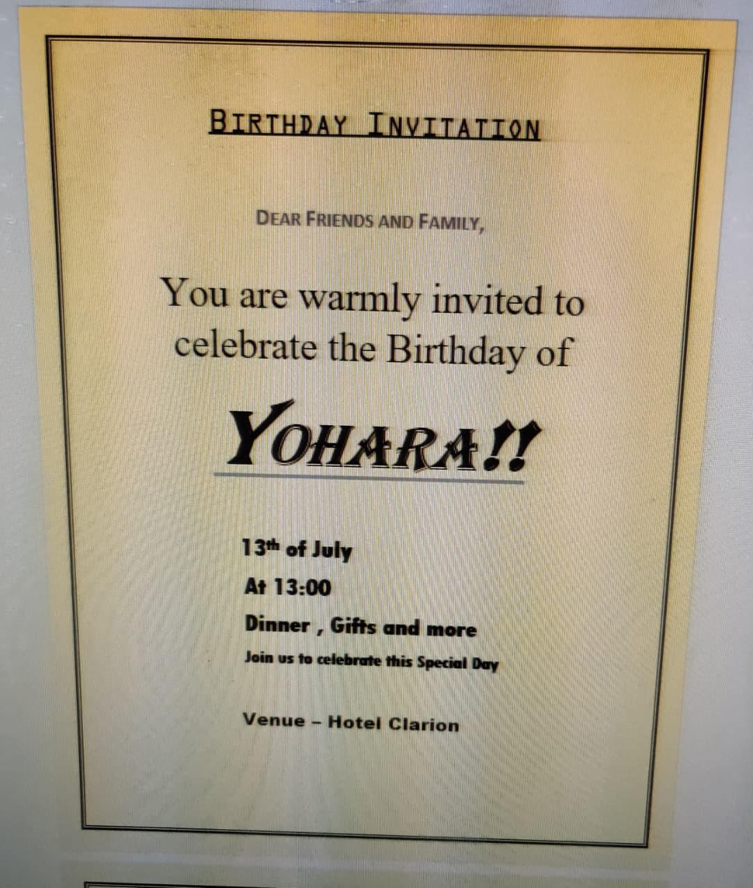

# 🗣️ English & Technical Linguistics Log
This is where I document my progress in mastering English as a "Technical Operating System" for my global career.

### 📚 Course Progress & Academic Path
*Tracking my journey from foundations to professional fluency.*

- ✅ **English Flyers (A2):** Initial foundations completed via [Udemy](https://udemy.com).
- 🔵 **Cambridge PET (B1):** Current focus on Grammar, Vocabulary, and Speaking at [ESOFT Kiribathgoda](https://esoft.lk).
- 🔜 **English for School Leavers:** Advanced professional foundations at [IHRA (University of Colombo)](https://cmb.ac.lk).
- ➕ **Additional Training:** New certifications and short courses will be documented here as I progress.

---

## 📝 Grammar & Vocabulary Notes

------------------------------
### 📅 Update: May 2, 2026

Focus: Cambridge PET Course - Day 1 @ IIT

#### 💡 What I Learned Today

* Topic: The fundamental building blocks of sentences: nouns, verbs, and connectors.
* Key Takeaway: Connectors are the "glue" that turn simple phrases into professional, flowing sentences.

#### 🛠️ Hands-on Actions / Commands

Nouns & Verbs: Identifying the "who" and the "action" to ensure subject-verb agreement.

* Connectors: Using words like however, therefore, and moreover to link ideas logically.

#### 📝 My Thoughts / Challenges

It was pretty easy to be honest

#### 🛠️ Grammar in Practice
- (Example: Documenting "Conditionals" or "Passive Voice" as you learn them at ESOFT).

#### 📖 Technical Vocabulary
- (Example: Words like "Implementation," "Redundancy," and "Authentication").

---
## ✍️ Professional Writing Samples

[May 3, 2026] PET Writing Task: Invitation 

Context: Cambridge PET Class @ IIT

Draft: 

## Grammar & Vocabulary Notes

### Update: May 10, 2026

Focus: Cambridge PET Course @ ESOFT

#### What I Learned Today

* Topic: Narrative sequencing, memory recall, and structured composition.
* Key Takeaway: Collaborative storytelling builds real-time sentence construction and active listening skills.

#### Hands-on Actions / Commands

* Story Chain: Repeating a growing scenario starting with "Me and my friends are on our way to school" and adding one cohesive sentence.

#### My Thoughts / Challenges

It was challenging to memorize every classmate's sentence while planning my own addition.

#### Grammar in Practice

* Practiced narrative tenses like Past Simple and Past Continuous to keep story events in chronological order.

#### Technical Vocabulary

* Words like "Sequence," "Cohesion," "Narrative," and "Composition."

---

## Professional Writing Samples

### [May 10, 2026] PET Writing Task: Essay

Context: Cambridge PET Class @ ESOFT
Draft:

#### Why Junk Food is Bad for You

Eating junk food has become a common habit due to convenience and taste. However, consuming these highly processed items regularly poses severe risks to long-term health. Junk food is typically loaded with high amounts of sugar, unhealthy fats, and sodium, while completely lacking essential nutrients like vitamins, minerals, and fiber.

When you eat these meals frequently, they cause rapid spikes in blood sugar. This process leads to constant energy crashes and increased cravings throughout the day. Over time, a diet high in fast food contributes heavily to serious chronic health issues, including obesity, type 2 diabetes, and heart disease. Furthermore, the lack of proper nutrition impacts mental clarity, leaving you feeling tired and unfocused.

In addition to physical harm, relying on fast food destroys healthy cooking habits. It also costs more money over time compared to preparing fresh food at home. Protecting your body requires choosing whole foods, such as fruits, vegetables, and lean proteins. In conclusion, cutting out junk food is the most effective choice to improve your energy, boost health, and ensure a vibrant life.

### [May 10, 2026] PET Writing Task: Short Story

Context: Cambridge PET Class @ ESOFT
Draft:

#### A Sudden Power Outage

It was a quiet evening, and I was sitting at my desk finishing a school assignment due the next morning. The only sound in the room was the steady hum of my laptop. Suddenly, the entire house plunged into complete and pitch-black darkness, and my computer screen died instantly.

A deep silence filled the room, making me realize how dependent I am on electricity. I carefully reached out into the dark, feeling around the cold surface of my desk until my fingers brushed against my smartphone. Turning on its flashlight, a bright beam of light cut through the shadows, casting long shapes against the walls.

I walked downstairs to find my family gathering in the living room with old wax candles. We lit them one by one, filling the space with a warm, flickering glow. Instead of studying, we spent the next two hours talking, laughing, and playing board games together. When the lights finally flashed back on, I realized that the sudden power outage turned a stressful evening into a highly memorable family night.

### Update: May 17, 2026
**Focus:** Cambridge PET Course @ ESOFT

#### What I Learned Today
* **Topic:** Spontaneous public speaking, improvisation techniques, and presentation under constraints.
* **Key Takeaway:** Delivering speeches without notes forces rapid thinking and improves real-time sentence structuring.

#### Hands-on Actions / Commands
* **Current Events Speech:** Delivered a 2-minute speech on the Russian war, adapting and improvising content on the spot due to a strict "no notes" rule.
* **Idol Speech:** Prepared and presented a 2-minute unscripted talk about William Shakespeare under the same constraint.

#### My Thoughts / Challenges
It was highly challenging to maintain a flow and construct logical points entirely from memory without relying on written cues.

#### Grammar in Practice
* Practiced spoken fluency, present and past tenses for ongoing geopolitical events, and descriptive adjectives for historical figures.

#### Technical Vocabulary
* Words like "Improvisation," "Spontaneous," "Extemporaneous," and "Fluency."

### Update: June 14, 2026

#### Focus: Cambridge PET Course @ ESOFT

#### What I Learned Today
* Topic: B1 PET Reading techniques (Parts 1–6) and structured guided writing prompts.
* Key Takeaway: Matching user preferences to activity schedules and skimming long factual texts for history and biography details.

#### Hands-on Actions / Commands
* Mock Exam Practice: Solved exercises on short text messages, event matching, articles on Hypnotism and the Trojan War, a biography of Modigliani, and practice prompts for an email and a stress article. You can view the full paper here: [View June 14 Exam Paper](./Past-Papers/ESOFT-Cambridge-PET/June-14-Paper.pdf)

#### My Thoughts / Challenges
It was challenging to accurately place sentence options into the gapped text for the Trojan War story without breaking the chronological flow.

#### Grammar in Practice
* Practiced past narrative tenses for historical reading contexts and structural shifts between informal replies and discursive article prompts.

#### Technical Vocabulary
* Words like "Hypnotism," "Mesmerism," "Equestrian," "Spectacular," and "Influence".

